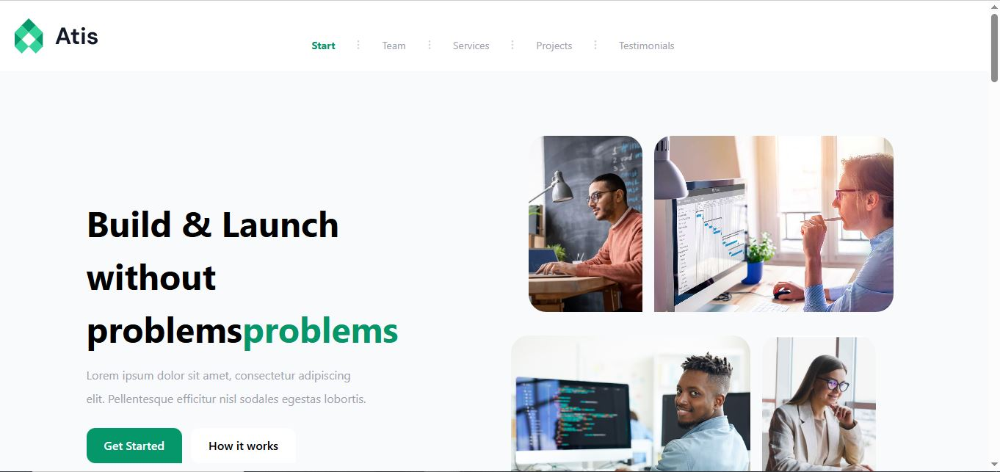
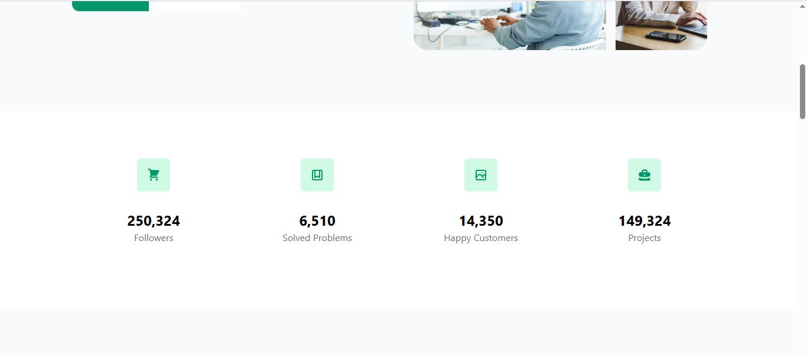
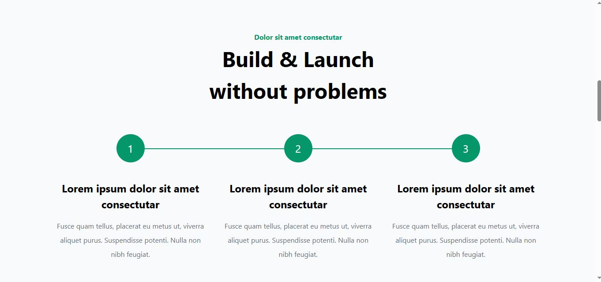
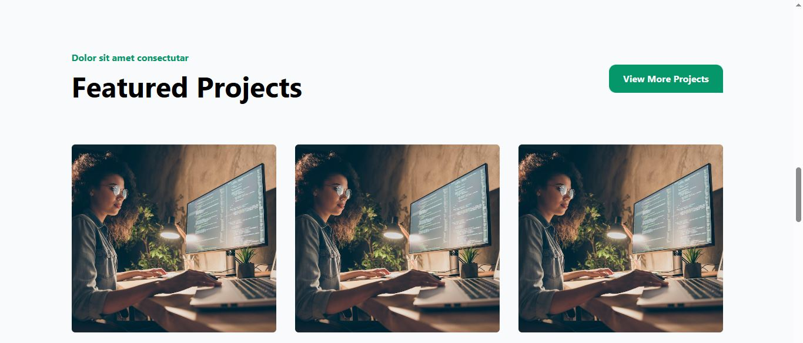
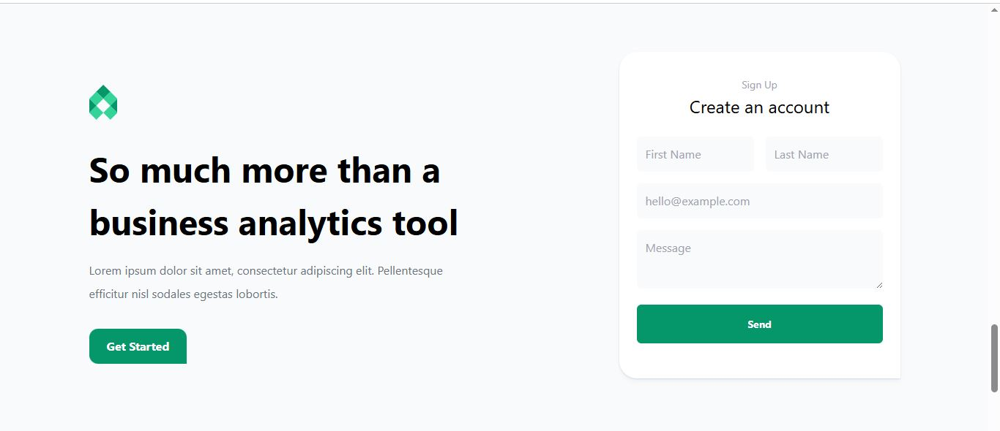
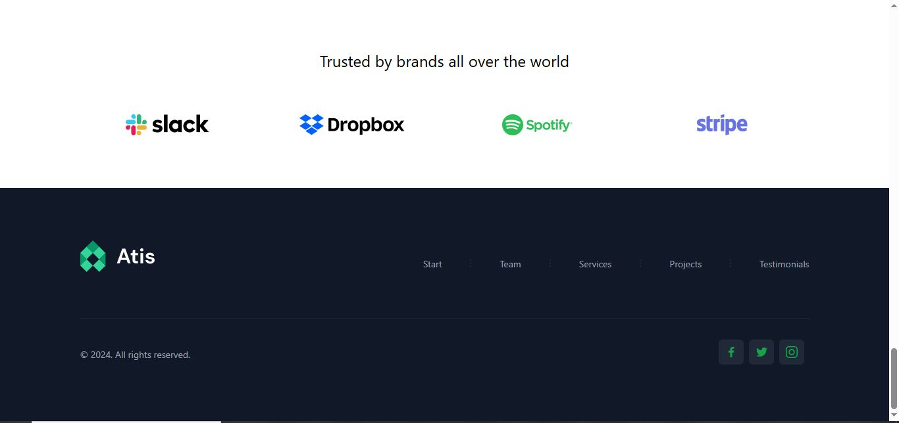

# SEO-Friendly Agency Website

This project is an SEO-friendly agency website developed to deliver a fast, responsive, and high-performance user experience.
It is built using **Next.js**, **HTML**, **Tailwind CSS**, and **Axios**, with integration to a **Custom REST API** for dynamic data handling.

The platform focuses on modern web standards, search engine optimization, and clean UI design to provide an engaging experience for users while maintaining strong performance and scalability.

---

## Live Preview

You can view the live version of the project here:

🔗 **Live Website:** seoagengey.netlify.app

---

## Project Preview

Below are some screenshots demonstrating the interface and layout of the website.
---







---

## Features

* Fully responsive and modern UI
* Clean and professional design using **Tailwind CSS**
* SEO optimization using **Next.js capabilities**
* Static Site Generation (SSG) for improved performance
* Dynamic routing for scalable page management
* Integration with a **Custom REST API**
* Fast data fetching using **Axios**
* Optimized page loading speed
* Intuitive navigation and improved user engagement

---

## Tech Stack

**Frontend Framework**

* Next.js

**Styling**

* HTML
* Tailwind CSS

**API Communication**

* Axios
* Custom REST API

**SEO & Performance**

* Static Site Generation (SSG)
* Dynamic Routing

---

## Project Structure

```
project-root
│
├── pages
│   ├── index.js
│   ├── about.js
│   ├── services.js
│   └── contact.js
│
├── components
│
├── styles
│
├── public
│
├── utils
│
└── README.md
```
